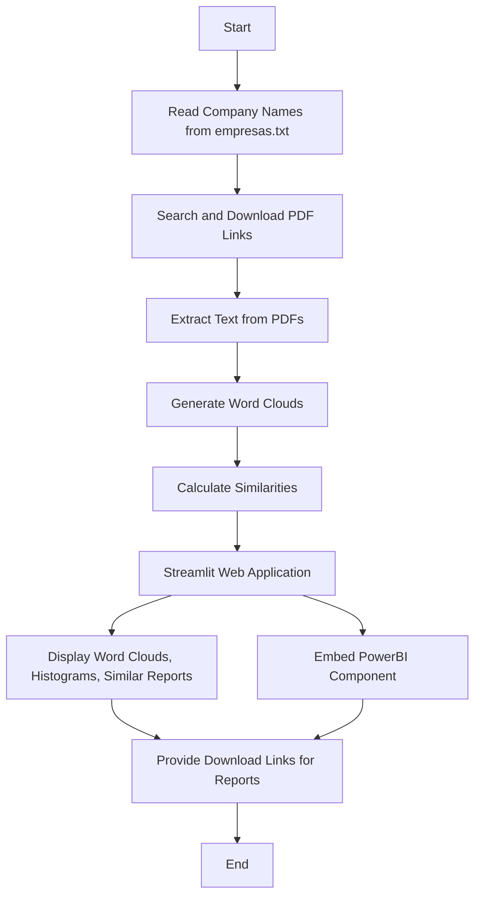

# PA_IGTI

## Introduction
PA_IGTI is a project focused on analyzing corporate sustainability reports. It includes routines for data collection, text extraction, word cloud generation, similarity calculations, and a Streamlit web application for visualization.

This project was part of the final credits required for approval in the Data Science MBA from the IGTI institute, now known as XP Education. The name "PA_IGTI" is a reduction of "academic project to IGTI institute."

## Features
### Data Collection and Processing
- **Company List**: A list of companies analyzed in the project. See [empresas.txt](empresas.txt).
- **Data Collection**: Functions for searching and downloading PDF links related to company sustainability reports. See [funcao.py](funcao.py).
- **Text Extraction**: Extracts text from PDF files and generates word clouds. See [script.py](script.py).

### Web Application
- **Streamlit App**: A web application that presents information about corporate sustainability, including word clouds, histograms, similar reports, and download links. See [app.py](app.py).

## Application Flowchart
Below is a flowchart that describes how the PA_IGTI app works:

### Explanation of Flowchart Steps
1. **Start**: The beginning of the process.
2. **Read Company Names**: Reads the company names from the `empresas.txt` file.
3. **Search and Download PDF Links**: Searches for PDF links related to company sustainability reports and downloads them.
4. **Extract Text from PDFs**: Extracts text content from the downloaded PDF files.
5. **Generate Word Clouds**: Generates word clouds from the extracted text.
6. **Calculate Similarities**: Performs similarity calculations between different reports.
7. **Streamlit Web Application**: Launches the Streamlit web application.
8. **Display Word Clouds, Histograms, Similar Reports**: Displays visualizations and similar reports within the app.
9. **Embed PowerBI Component**: Embeds a PowerBI component for exploring relationships.
10. **Provide Download Links for Reports**: Offers download links for the sustainability reports.
11. **End**: The end of the process.

## Requirements
See [requirements.txt](requirements.txt) for the list of dependencies.

## Contributing
If you want to collaborate with this project, feel free to fork it and submit a pull request. I´ll be happy to review and merge it.
## Contact Me

If you are interested in collaboration, have inquiries about my availability, or simply want to discuss shared interests, feel free to [email me](mailto:mellogcg@gmail.com) or connect with me on [LinkedIn](https://www.linkedin.com/in/gabriel-guimaraes-de-mello/). I look forward to exploring opportunities to work together!
